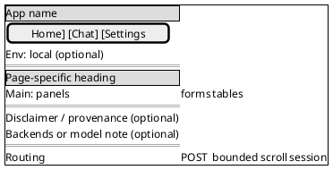

# Wireframes (text + PlantUML)

## Description

Defines how to document UI layout as **structured prose** plus a **PlantUML Salt** (`@startsalt`) sketch so both humans and tools share the same regions. Use for shells, screens, and multi-step flows in markdown docs or specs.

**This repository:** canonical DocuRAG UI wireframes live in [`docs/DocuRAG-WIREFRAMES.md`](../../../docs/DocuRAG-WIREFRAMES.md).

## When to use

- Designing or documenting pages, navigation shells, forms, or transcripts.
- Any task that asks for wireframes, page structure, or layout diagrams alongside narrative.

## Instructions

Deliver **both**:

1. **Text wireframe** — hierarchical markdown: `##` screen title, optional **Screen:** line, nested bullets, `[Bracket labels]` for placeholders, links to flow docs when relevant.
2. **PlantUML** — fenced `plantuml` block with **`@startsalt`** … **`@endsalt`** (wireframe-style).

**Text structure**

- Major regions as bold labels (**Header**, **Main content**, **Footer / meta**) with nested bullets.
- Include **Global behavior** when it matters: routing, HTTP method (e.g. POST + server render), bounded scroll for long content, session strategy.
- Include **Safety / provenance / transparency** when the UI shows disclaimers, data sources, or model/backend notes.

**Salt conventions**

- `{+` … `}` — framed page or panel.
- `{* Title }` — section headers inside salt.
- `==` — horizontal bands (header / main / footer).
- `[Label]` — nav tabs or buttons; short plain lines for notes.
- Mirror the same regions as the text wireframe.

**Example pattern**

Text:

```markdown
## 1. Global page shell

**Screen: Shared shell (all UI pages)**

- Header / navigation
    - [Brand link] App name
    - [Nav] Home | Chat | Settings
    - Optional: environment badge

- Main content
    - Page-specific heading
    - Page-specific panels, forms, or tables

- Footer / meta
    - Disclaimer or provenance if required
    - Optional: backend or model transparency

- Global behavior
    - Deep-linkable routes
    - POST + re-render (or as specified)
    - Bounded scroll for long assistant content
    - Session (cookie / hidden id per flow doc)
```

PlantUML companion:



**Checklist:** every band in salt appears in the text wireframe; placeholders marked in both.

## Boundaries

- Does not replace implementation; no pixel-perfect specs unless requested.
- Do not duplicate long product copy inside diagrams—keep salt labels short.
