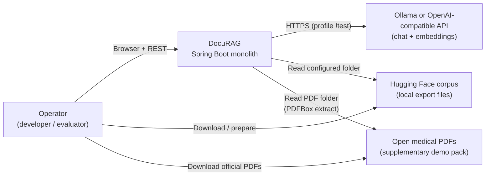
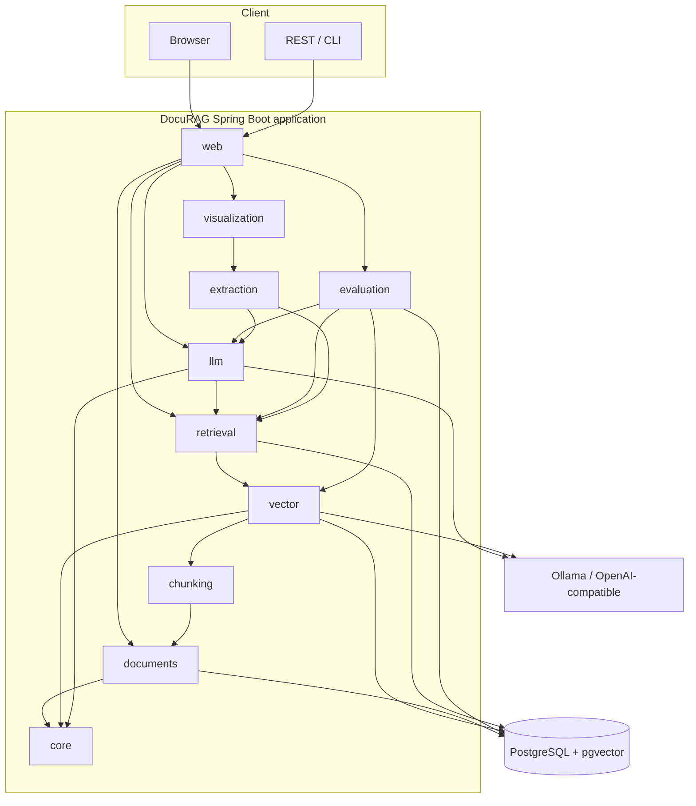
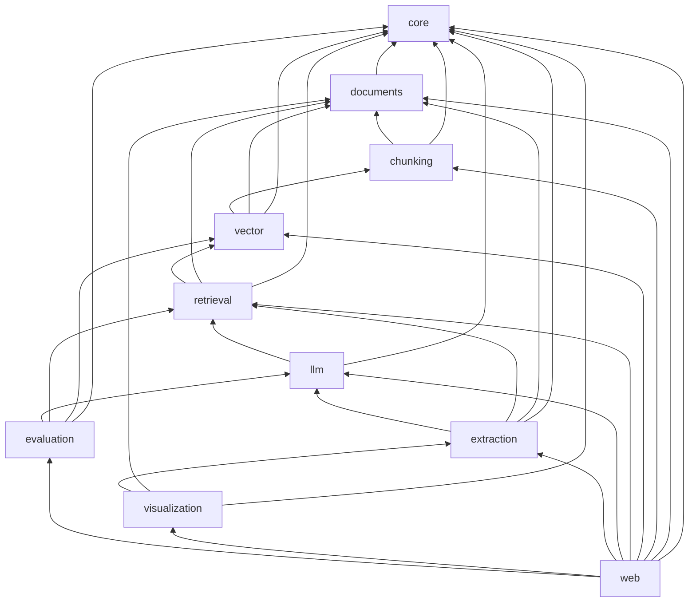
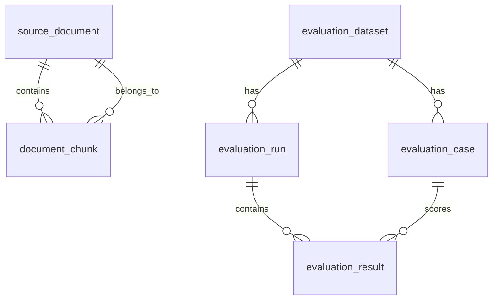
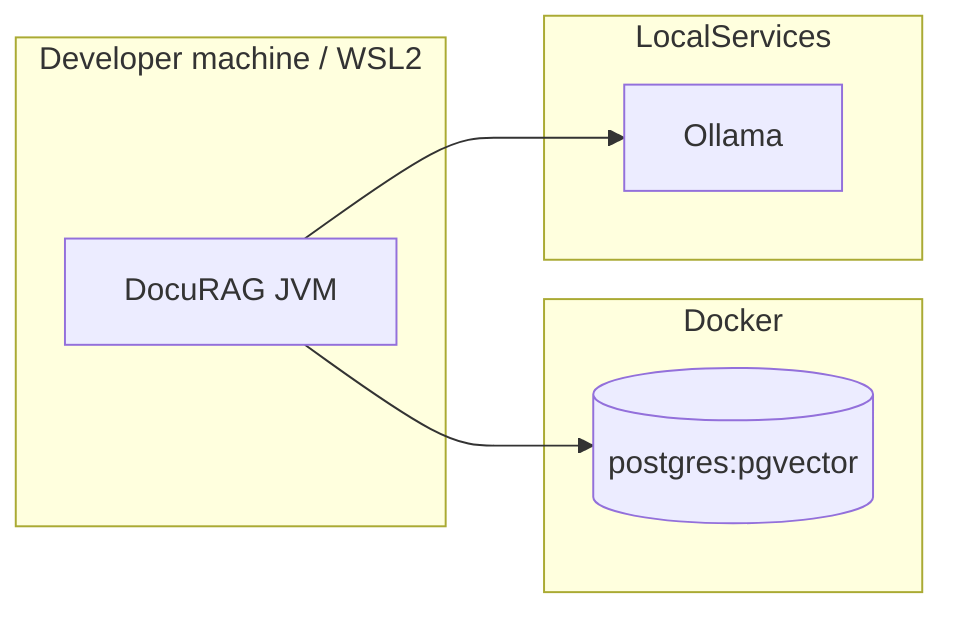
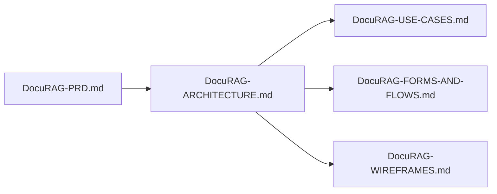

# DocuRAG — Architecture design

Consolidated **architecture description** for DocuRAG. **Normative requirements** remain in [DocuRAG-PRD.md](DocuRAG-PRD.md); this document structures them for engineering review, onboarding, and implementation.

**Related artifacts**

| Artifact | Role |
|----------|------|
| [DocuRAG-PRD.md](DocuRAG-PRD.md) | Full requirements, FR/NFR, API examples, milestones |
| [DocuRAG-Datasets.md](DocuRAG-Datasets.md) | Primary HF corpus + supplementary PDF URL catalog and layout |
| [DocuRAG-USE-CASES.md](DocuRAG-USE-CASES.md) | Use case catalog |
| [DocuRAG-FORMS-AND-FLOWS.md](DocuRAG-FORMS-AND-FLOWS.md) | UI forms and process flows |
| [DocuRAG-WIREFRAMES.md](DocuRAG-WIREFRAMES.md) | Page-level wireframes |

---

## Table of contents

1. [System context](#1-system-context)
2. [Goals and constraints](#2-goals-and-constraints)
3. [Technology stack](#3-technology-stack)
4. [Logical architecture](#4-logical-architecture)
5. [Modulith application design](#5-modulith-application-design)
6. [Runtime flows](#6-runtime-flows)
7. [Data architecture](#7-data-architecture)
8. [Integration and external systems](#8-integration-and-external-systems)
9. [API and presentation layers](#9-api-and-presentation-layers)
10. [Cross-cutting concerns](#10-cross-cutting-concerns)
11. [Deployment topology](#11-deployment-topology)
12. [Quality attributes](#12-quality-attributes)
13. [Testing architecture](#13-testing-architecture)
14. [Extension points and non-goals](#14-extension-points-and-non-goals)
15. [Documentation map](#15-documentation-map)

---

## 1. System context

DocuRAG is a **single deployable backend** (Spring Boot) used by **operators** (developers, evaluators) via **browser** and **REST clients**. It ingests an **English medical corpus**, indexes **embeddings** in **PostgreSQL + pgvector**, and answers questions using **retrieval + LLM**. Optional **course** submission artifacts are out of scope for runtime architecture.

---

## 2. Goals and constraints

| Type | Content |
|------|---------|
| **Product** | English medical RAG: ingest (**HF structured exports + PDF text extraction**) → chunk → embed → retrieve → grounded QA; extraction for **pie + graph**; **eval** with ≥1 metric on a small set (PRD). |
| **Package** | `com.berdachuk` / `com.berdachuk.docurag.*` |
| **Modularity** | **Spring Modulith** — `package-info.java`, `allowedDependencies`, **`*.api`** only across modules. |
| **Persistence** | **JDBC + Flyway**; **no JPA / Spring Data**. |
| **IDs** | **ObjectId-style** 24 hex strings; **`IdGenerator`** in `core`. |
| **AI** | **Spring AI 2.x**, **`spring-ai-starter-model-openai`**, programmatic beans; **separate** chat vs embedding config (`spring.ai.custom.*`). |
| **v1 exclusions** | No multi-tenant ACL, no multimodal OCR, no SPA, no real-time external corpus sync (PRD non-goals). |

---

## 3. Technology stack

| Layer | Technology | Notes |
|-------|------------|--------|
| Runtime | Java **21+** | |
| Framework | **Spring Boot** + **Spring Modulith** | BOM aligned with Boot (e.g. 2.0.x Modulith) |
| GenAI | **Spring AI** (e.g. **2.0.0-M4** per PRD) | OpenAI-compatible client only |
| Web | **Spring Web MVC**, **Thymeleaf** | Server-rendered demo UI |
| Data | **PostgreSQL** + **pgvector** | `vector(768)` on chunks |
| Migrations | **Flyway** | Preferred |
| Build | **Maven** | `mvn verify` = tests + Modulith |
| Local infra | **Docker Compose** + **WSL2** | Dev parity |
| Tests | **JUnit**, **Testcontainers** | pgvector image; **mocked** AI in default suite |
| Primary dataset | [medical-rag-corpus](https://huggingface.co/datasets/Sagarika-Singh-99/medical-rag-corpus) | Subset + manifest |
| PDF demo pack | Open English medical PDFs (EU / NHS / similar) | Documented in `docu-rag/data/pdf-demo/README.md`; **PDFBox** in **`documents`** |

---

## 4. Logical architecture

Single **modular monolith** process containing all bounded contexts. External dependencies: **database**, **LLM/embedding HTTP API** (e.g. Ollama).

*(Edges are logical; exact dependencies follow Modulith `allowedDependencies` in §5.)*

---

## 5. Modulith application design

### 5.1 Module catalog

| `id` | Package | Responsibility |
|------|---------|----------------|
| `core` | `...docurag.core` | DataSource/JDBC config, **`DocuRagAiConfiguration`**, **`IdGenerator`**, shared exceptions; often **OPEN** |
| `documents` | `...docurag.documents` | Corpus ingest (**structured + PDF**), `source_document`, **PDFBox** (or equivalent) |
| `chunking` | `...docurag.chunking` | Chunking policy + chunk rows |
| `vector` | `...docurag.vector` | **`EmbeddingModel`** calls, pgvector writes |
| `retrieval` | `...docurag.retrieval` | Similarity search, **no** generative LLM |
| `llm` | `...docurag.llm` | **`ChatClient`**, advisors, RAG assembly |
| `extraction` | `...docurag.extraction` | Structured extraction for viz |
| `visualization` | `...docurag.visualization` | Chart/graph DTOs |
| `evaluation` | `...docurag.evaluation` | Eval runs, scoring, persistence |
| `web` | `...docurag.web` | REST + Thymeleaf; **OPEN** or wide deps |

### 5.2 Declared dependency DAG (initial)

### 5.3 Boundary rules

- Import only **`com.berdachuk.docurag.<module>.api.*`** from other modules.
- **`@ApplicationModule`** on each root package; **`mvn verify`** fails on violations.
- Bootstrap: **`DocuRagApplication`** (or Run-owner variant) as Spring Boot entry.

---

## 6. Runtime flows

### 6.1 Ingestion and indexing

`documents` → `chunking` → `vector`: normalize rows, dedupe by `external_id`/hash, assign **`IdGenerator`** ids, split chunks, batch **embed**, upsert **`document_chunk.embedding`**.

### 6.2 Question answering

`retrieval` queries pgvector by question embedding → `llm` builds prompt with **`QuestionAnswerAdvisor`** (optional **`RetrievalAugmentationAdvisor`**) → HTTP response with answer + **retrievedChunks**.

### 6.3 Analysis and visualization

`extraction` uses LLM for strict JSON → `visualization` builds pie + graph DTOs → `web` / REST serves UI or JSON.

### 6.4 Evaluation

`evaluation` loads dataset → for each case runs same RAG path → scores (**normalized accuracy**, **cosine similarity**, **Semantic@0.80**) → persists **`evaluation_run`** / **`evaluation_result`**.

*(Sequence diagrams: [DocuRAG-FORMS-AND-FLOWS.md](DocuRAG-FORMS-AND-FLOWS.md).)*

---

## 7. Data architecture

### 7.1 Identifier strategy

- **PKs / FKs:** `text` (or `varchar(24)`), **24 hex** chars, optional `CHECK (id ~ '^[0-9a-fA-F]{24}$')`.
- **Corpus keys:** `external_id` may be any string.

### 7.2 Primary tables

| Table | Role |
|-------|------|
| `source_document` | Ingested corpus rows; **`source_format`** (`hf_export`, `pdf`, …) |
| `document_chunk` | Chunks + **`vector(768)`** |
| `ingestion_job` | Batch status |
| `evaluation_dataset` | Eval set metadata |
| `evaluation_case` | Q + ground truth |
| `evaluation_run` | Aggregate metrics |
| `evaluation_result` | Per-case scores + `retrieved_chunks_json` |

### 7.3 Vector operations

- **Write path:** `vector` module after embedding.
- **Read path:** `retrieval` — cosine (or L2 per config) against `embedding`.
- **No** required Spring **`VectorStore`** abstraction (PRD: JDBC persistence).
- **Optional bulk throughput:** **`docurag.ingestion.embeddings.multi-endpoint`** — pool of OpenAI-compatible embedding URLs (ExpertMatch `EmbeddingEndpointPool` pattern): shared queue, workers per endpoint, skip-on-failure, `api-batch-size` for batched `embedForResponse`. Empty `endpoints` → single **`spring.ai.custom.embedding`** only. All pool endpoints must output **768-d** compatible vectors.

### 7.4 Conceptual ER (simplified)

---

## 8. Integration and external systems

| System | Direction | Protocol | Usage |
|--------|------------|----------|--------|
| **Ollama** (or compatible) | Outbound | HTTPS OpenAI-compatible | `OpenAiChatModel`, `OpenAiEmbeddingModel` |
| **Multiple Ollama / embed nodes** | Outbound (optional) | HTTPS | **Bulk chunk embedding only** — `docurag.ingestion.embeddings.multi-endpoint.endpoints[]` (`url`, `model`, `priority`, optional `workers`); failover + parallelism per PRD |
| **Hugging Face** | Human + file | N/A at runtime | Corpus downloaded → local files → ingest |
| **PDF files (demo pack)** | Local disk | N/A at runtime | Configured directory → **PDFBox** text extract → same pipeline as structured docs |
| **PostgreSQL** | Bidirectional | JDBC | All durable state |

**Configuration:** `spring.ai.custom.chat.*`, `spring.ai.custom.embedding.*`; env vars (e.g. `CHAT_BASE_URL`, `EMBEDDING_MODEL`). **Auto-config excluded**; beans in **`DocuRagAiConfiguration`** (`@Profile("!test")`).

**Multi-endpoint embeddings (optional):** Same pattern as ExpertMatch — `@ConfigurationProperties` on `docurag.ingestion.embeddings.multi-endpoint`, conditional **`EmbeddingEndpointPool`** bean when `endpoints[0].url` is set, **`@Primary` `EmbeddingService`** implementation delegating to the pool vs single-endpoint fallback. Shared **`spring.ai.custom.embedding.api-key`** and **dimensions** across pool clients. See PRD § *Multi-endpoint embedding providers*.

---

## 9. API and presentation layers

### 9.1 REST groups (PRD)

| Area | Examples |
|------|-----------|
| Documents | `POST /api/documents/ingest`, `GET /api/documents`, `.../{id}`, `.../categories` |
| Index | `POST /api/index/rebuild`, `POST /api/index/incremental`, `GET /api/index/status` |
| RAG | `POST /api/rag/ask`, `POST /api/rag/analyze`, optional `GET .../history/{id}` |
| Viz | `GET .../visualizations/categories/pie`, `.../entities/graph` |
| Evaluation | `POST .../evaluation/run`, `GET .../runs`, `.../runs/{id}`, `.../latest` |

### 9.2 API-first contract implementation

- `docu-rag/api/openapi.yaml` is the canonical REST contract for `/api/**`.
- App build generates Spring server interfaces/models into `target/generated-sources/openapi`.
- `web.rest` controllers implement generated interfaces from `com.berdachuk.docurag.web.openapi.api` and map to internal module APIs (`*.api` records).
- Request validation follows OpenAPI-required fields and produces RFC7807-style problem responses for invalid payloads.
- `docu-rag-e2e` generates its client from the same `openapi.yaml`, keeping provider/consumer in lockstep.

### 9.3 Presentation (Thymeleaf)

| Path | Purpose |
|------|---------|
| `/` | Dashboard |
| `/qa` | Q&A form + results |
| `/analysis` | Charts + graph |
| `/documents` | Paginated list |
| `/evaluation` | Run eval + summary |

**Rules:** POST forms, server re-render, disclaimer on interactive pages, light JS for charts ([DocuRAG-WIREFRAMES.md](DocuRAG-WIREFRAMES.md)).

---

## 10. Cross-cutting concerns

| Concern | Approach |
|---------|-----------|
| **Logging** | Ingest, embed, retrieve, generate, eval latencies (NFR-4) |
| **Health** | Spring **Actuator** — app + DB |
| **Security v1** | No end-user auth in PRD; secrets via **env**; optional Spring Security for CSRF if enabled |
| **Compliance** | UI/API disclaimers — not medical advice |
| **Prompting** | QA: context-only; extraction: strict JSON (PRD) |

---

## 11. Deployment topology

**Development (target):**

- **`compose.yaml`:** PostgreSQL + pgvector for local DB.
- **`application-local.yml`:** local-only (gitignored) datasource + AI endpoints. Use `application-local.example.yml` as the template to copy locally.
- **README:** WSL2 + Docker troubleshooting.

**Production:** Not specified as a product goal; same process model scales to a single host or container image + managed Postgres + remote OpenAI-compatible endpoint.

---

## 12. Quality attributes

| NFR (PRD) | Architectural mechanism |
|-----------|-------------------------|
| **Maintainability (NFR-1)** | Modulith + JDBC + explicit SQL |
| **Reproducibility (NFR-2)** | Docker, Testcontainers, documented env |
| **Performance (NFR-3)** | Batch embed, bounded corpus size, warm index SLA guidance |
| **Observability (NFR-4)** | Logs + Actuator |
| **Safety (NFR-5)** | Disclaimers + grounded prompts |
| **Identifiers (NFR-6)** | `IdGenerator`, DB constraints |
| **Integration tests (NFR-7)** | Full-flow IT, mocked AI, optional skip profile |

---

## 13. Testing architecture

| Layer | Scope |
|-------|--------|
| **Unit** | Chunking, `IdGenerator`, mappers, metric math, **PDF text extraction** (minimal PDF bytes) |
| **Integration** | Testcontainers **PostgreSQL + pgvector**, Flyway, **mock `ChatModel`/`EmbeddingModel`**, full pipeline IT (fixture may include **tiny PDF** or structured-only ingest) |
| **Modulith** | `@ApplicationModuleTest` / architecture verification |
| **Demo / smoke** | Key pages and REST with test profile |

**Rule:** Default **`mvn verify`** does **not** require live Ollama.

---

## 14. Extension points and non-goals

**In-scope API direction (ninja-friendly):**

- **`POST /api/index/incremental`** — partial re-embed without full rebuild.

**Explicit non-goals (v1):** ACL-aware RAG, **multimodal / OCR** for scanned PDFs (text-layer PDFs only in baseline), separate FTS engine, SPA, user accounts, message brokers (PRD).

**Optional eval / retrieval research:** precision/recall with labeled chunks; faithfulness / NLI / judge — documented as PRD optional extensions.

---

## 15. Documentation map

---

**Document version:** 1.0 — aligned with [DocuRAG-PRD.md](DocuRAG-PRD.md). Update when modules, APIs, or deployment assumptions change.
