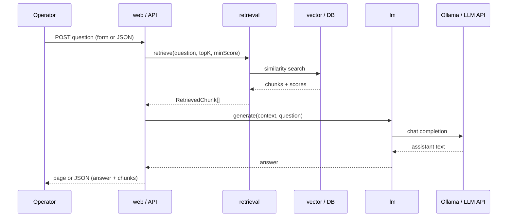
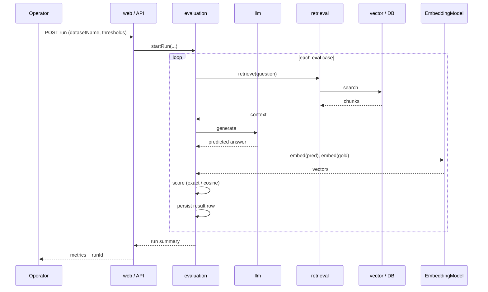
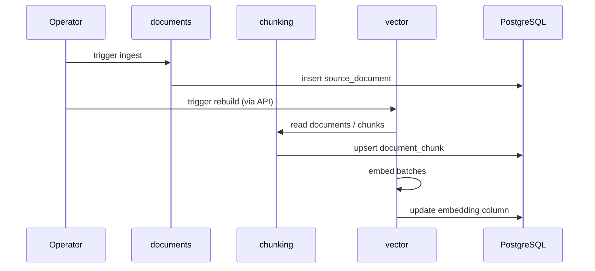
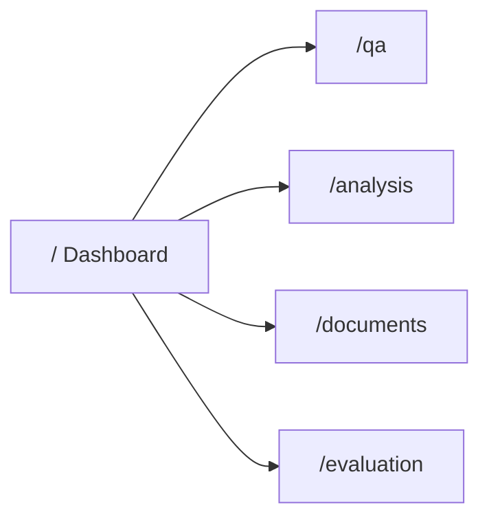

# DocuRAG — Forms and flows

Specification of **Thymeleaf forms**, **page navigation**, and **end-to-end flows** (UI + REST + background steps). Aligned with [DocuRAG-PRD.md](DocuRAG-PRD.md) and [DocuRAG-USE-CASES.md](DocuRAG-USE-CASES.md).

**Global UI rules (PRD):**

- Forms use **HTTP POST** and **server re-render** with results (no SPA).
- **Lightweight JavaScript** only for chart/graph rendering (e.g. canvas/SVG libs).
- Every **interactive** page shows the **medical disclaimer** (not medical advice).
- Show **model names** and **dataset** identifiers where relevant.

---

## 1. Page map and form inventory

| Path | Primary purpose | Form? | Method | Notes |
|------|-----------------|-------|--------|--------|
| `/` | Dashboard | Optional | POST | May use POST for short actions (e.g. trigger ingest/rebuild) if implemented; otherwise GET + links only. |
| `/qa` | Grounded Q&A | **Yes** | POST | Main user input: question + retrieval options. |
| `/analysis` | Charts + graph | **Optional** | POST or GET | PRD: analysis results; may POST to run analysis then re-render, or GET with query scope. |
| `/documents` | Document list | **Optional** | GET / POST | Pagination/filter often **GET** query params; POST acceptable for filter form. |
| `/evaluation` | Run eval + summary | **Yes** | POST | Dataset + RAG parameters; table of results. |

---

## 2. Form specifications (Thymeleaf)

### F-01 — Dashboard actions (optional)

**Page:** `/`  

If the implementation exposes operator shortcuts from the dashboard (not mandatory if actions live only on API/CLI):

| Field | Type | Required | Description |
|-------|------|----------|-------------|
| `action` | hidden or button name | Yes | e.g. `INGEST`, `REBUILD_INDEX` (implementation-specific) |
| `ingestTarget` | select or radio | No | e.g. **`HF_EXPORT`** vs **`PDF_DEMO`** when both paths are configured (PRD: primary corpus vs supplementary PDF folder) |
| CSRF | token | Yes | Spring Security default if enabled |

**Submit:** POST to a dedicated handler (e.g. `POST /` or `POST /actions/ingest`) → redirect or re-render dashboard with flash message.

**Outcome:** Updated status counts, link to job log or error message.

**REST parallel:** `POST /api/documents/ingest` may accept a JSON body or query flag to choose **structured corpus directory** vs **PDF demo directory** (see [DocuRAG-PRD.md](DocuRAG-PRD.md) FR-1).

---

### F-02 — Ask question (Q&A)

**Page:** `/qa`  
**UC:** UC-10  

| Field | Name (suggested) | Type | Required | Default | Validation |
|-------|------------------|------|----------|---------|------------|
| Question | `question` | textarea | Yes | — | Non-blank, max length per config |
| Top-K | `topK` | number | No | `5` | Integer ≥ 1, ≤ max allowed |
| Min score | `minScore` | number | No | `0.70` | 0.0–1.0 |

**Submit:** `POST /qa` (or `POST /qa/ask`).

**Success response:** Same page with model attributes: `question`, `answer`, `retrievedChunks[]` (title, category, score, snippet, documentId), `modelName`.

**Failure / edge:** Empty question → field error; LLM/retrieval errors → user-visible message; insufficient context → answer text per prompt policy (still 200 + re-render).

**Parallel REST:** [§ JSON “forms” — RAG](#3-json-forms-rest-post-bodies).

---

### F-03 — Analysis scope (optional)

**Page:** `/analysis`  
**UC:** UC-14  

If analysis is **not** automatic for full corpus, the page may post a scope:

| Field | Type | Required | Description |
|-------|------|----------|-------------|
| `scope` | select | No | e.g. `ALL`, `CATEGORY`, `SAMPLE` |
| `category` | text | No | If scope = category |
| `maxDocuments` | number | No | Cap for demo performance |

**Submit:** `POST /analysis` → server runs extraction/aggregation → re-render with chart DTOs.

**Alternative:** `GET /analysis` loads last-computed or cached aggregates; separate **POST** only when “Refresh analysis” is needed.

**Data for charts:** Server passes pie + graph payloads to Thymeleaf; **JS** renders from embedded JSON or data attributes.

---

### F-04 — Document list filters / pagination

**Page:** `/documents`  
**UC:** UC-03  

| Pattern | Method | Parameters (suggested) |
|---------|--------|-------------------------|
| Pagination | GET | `page`, `size` |
| Filter | GET or POST | `category`, `q` (title search) |

**PRD:** Paginated list; POST is allowed if using a filter form that re-renders the table.

---

### F-05 — Run evaluation

**Page:** `/evaluation`  
**UC:** UC-15, UC-19  

| Field | Name (suggested) | Type | Required | Default |
|-------|------------------|------|----------|---------|
| Dataset | `datasetName` | text/select | Yes | e.g. `medical-rag-eval-v1` |
| Top-K | `topK` | number | No | `5` |
| Min score | `minScore` | number | No | `0.70` |
| Semantic pass threshold | `semanticPassThreshold` | number | No | `0.80` |

**Submit:** `POST /evaluation/run` (web handler delegates to evaluation service).

**Success:** Re-render with `runId`, aggregate metrics (`normalizedAccuracy`, `meanSemanticSimilarity`, `semanticAccuracyAt080`), optional per-case table or link to detail.

**Parallel REST:** `POST /api/evaluation/run` — see [DocuRAG-PRD.md](DocuRAG-PRD.md) (API Requirements, example response).

---

## 3. JSON “forms” (REST POST bodies)

Endpoints that accept JSON act as **machine-facing forms** (same semantics as UI where applicable).

| Operation | Method + path | Body fields |
|-----------|-----------------|-------------|
| Ingest | `POST /api/documents/ingest` | Implementation-defined (e.g. path, manifest id, or empty if server uses fixed folder) |
| Rebuild index | `POST /api/index/rebuild` | Usually empty or options object |
| Incremental index | `POST /api/index/incremental` | Optional since/until or document ids |
| Ask | `POST /api/rag/ask` | `question`, `topK`, `minScore` |
| Analyze | `POST /api/rag/analyze` | Scope/filters per API contract |
| Run evaluation | `POST /api/evaluation/run` | `datasetName`, `topK`, `minScore`, `semanticPassThreshold` |

**Responses:** See PRD **Example request/response shapes** for `rag/ask` and `evaluation/run`.

---

## 4. End-to-end flows (narrative)

### Flow A — First-time corpus load → searchable index

1. Operator places Hugging Face export / manifest under configured path.
2. **Ingest:** `POST /api/documents/ingest` or dashboard/CLI → documents persisted, `external_id` / hash dedupe, ObjectId `id`.
3. **Chunk:** Part of rebuild pipeline (FR-2) — configurable size/overlap.
4. **Embed + store:** Batches to `nomic-embed-text`, retries, `vector(768)` on chunks.
5. **Verify:** `GET /api/index/status` and dashboard counts.

**Blocks if:** DB down, embedding API down (non-test), empty corpus.

---

### Flow B — Grounded question answering

1. Operator opens `/qa` or calls `POST /api/rag/ask`.
2. **Retrieval** module: embedding query (or lexical if added later), pgvector top-k, threshold filter.
3. **LLM** module: build context from chunks, advisor applies “answer from context only”.
4. **Response:** Answer text + chunk list + model id.
5. UI shows disclaimer + sources.

**Variant — insufficient context:** LLM returns explicit “insufficient information in retrieved context” (prompt policy).

---

### Flow C — Analysis and visualization

1. Operator opens `/analysis` or triggers `POST /api/rag/analyze` (and/or GET viz endpoints).
2. **Extraction:** structured LLM output (categories, entities, relations) over corpus slice or cached chunks.
3. **Visualization** module: build pie (category distribution) + graph (nodes/edges).
4. Page loads `GET /api/visualizations/categories/pie` and `.../entities/graph` or receives DTOs from controller.
5. **JS** draws chart/graph.

---

### Flow D — Evaluation batch

1. Operator ensures eval dataset imported (versioned JSON/DB per PRD).
2. **Submit:** F-05 or `POST /api/evaluation/run`.
3. For each case: RAG pipeline → predicted answer → normalized accuracy + embedding cosine vs gold.
4. Persist `evaluation_run` + `evaluation_result` rows.
5. UI/API shows aggregates; optional drill-down to run id.

---

### Flow E — Browse documents

1. UI: `GET /documents?page=` (demo page).
2. REST: `GET /api/documents?page=&size=` (OpenAPI).
2. Server loads page of `source_document` rows.
3. Optional: link to detail `GET /api/documents/{id}` from UI.

---

## 5. Sequence diagrams (Mermaid)

### Flow B — Q&A (simplified)

### Flow D — Evaluation (simplified)

### Flow A — Ingest + rebuild index (simplified)

---

## 6. Navigation graph (UI)

All listed pages include **disclaimer** and links back to dashboard where useful.

---

## 7. Error and empty states (UI)

| Situation | Expected UX |
|-----------|-------------|
| No documents yet | Dashboard/documents: message + link to ingest instructions |
| Index missing / stale | Q&A: warn before ask or clear error after retrieval returns empty |
| LLM timeout | Friendly error; log server-side (NFR-4) |
| Eval dataset missing | Evaluation form: validation error, dataset list empty |
| Invalid `datasetName` | 400 + message |

---

## 8. Cross-reference

| This doc | Related |
|----------|---------|
| Forms F-02, F-05 | [DocuRAG-PRD.md](DocuRAG-PRD.md) — Example JSON for `/api/rag/ask`, `/api/evaluation/run` |
| Flows A–D | [DocuRAG-USE-CASES.md](DocuRAG-USE-CASES.md) — UC-01, UC-06, UC-09–11, UC-15 |
| Modules | PRD — System Architecture (retrieval vs llm) |

---

**Document version:** 1.0. Extend when `openapi.yaml` or Thymeleaf templates add fields.
