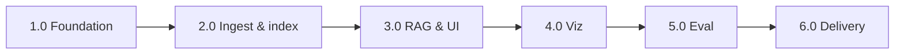

# DocuRAG — Implementation plan and WBS

**Work Breakdown Structure (WBS)** and implementation sequencing for DocuRAG. Normative scope: [DocuRAG-PRD.md](DocuRAG-PRD.md). Related: [DocuRAG-ARCHITECTURE.md](DocuRAG-ARCHITECTURE.md), [DocuRAG-Datasets.md](DocuRAG-Datasets.md) (HF + PDF URL catalog), [DocuRAG-USER-STORIES.md](DocuRAG-USER-STORIES.md), [DocuRAG-USE-CASES.md](DocuRAG-USE-CASES.md).

**Target window (course):** **Apr 2–Apr 17, 2026** (RAG Creation practical task — PRD Milestones).

**Package root:** `com.berdachuk.docurag.*` (Modulith modules per PRD).

---

## 1. Objectives of this plan

| # | Objective |
|---|-----------|
| O1 | Decompose delivery into **work packages** with clear outputs and verification. |
| O2 | Align WBS nodes with **PRD milestones M1–M6** and **user stories US-xx**. |
| O3 | Expose **dependencies** (technical order) and **parallel opportunities**. |
| O4 | Support **incremental demo**: ingest → index → QA → viz → eval → submission. |

---

## 2. WBS numbering convention

| Level | Pattern | Example |
|-------|---------|---------|
| Phase | `X.0` | `3.0` — RAG QA & demo UI |
| Work package | `X.Y` | `3.2` — REST `POST /api/rag/ask` |
| Task (optional) | `X.Y.Z` | `3.2.1` — Request/response DTOs |

**Milestone mapping:** Phase **1.0** ≈ **M1**, **2.0** ≈ **M2**, … **6.0** ≈ **M6** (PRD).

---

## 3. WBS outline (summary tree)

```
DocuRAG Implementation
├── 1.0 Foundation & platform (M1)
│   ├── 1.1 Maven project, Spring Boot, BOMs (Boot, Modulith, Spring AI)
│   ├── 1.2 Modulith modules: package-info, api stubs, dependency DAG
│   ├── 1.3 Flyway: schema + pgvector + text PKs (ObjectId-style)
│   ├── 1.4 core: JDBC, IdGenerator, exceptions
│   ├── 1.5 core: DocuRagAiConfiguration + TestAIConfig (profile test)
│   ├── 1.6 DevOps: Docker Compose, application-local.example.yml (+ local-only application-local.yml), README skeleton
│   └── 1.7 Quality gate: @ApplicationModuleTest, mvn verify (unit + Modulith)
├── 2.0 Corpus, chunking, vectors, retrieval (M2)
│   ├── 2.1 Dataset: HF subset manifest, sample fixture files, **pdf-demo README** (open medical PDF sources)
│   ├── 2.2 documents: ingest (**structured + PDF/PDFBox**), dedupe, ingestion_job, REST/UI trigger
│   ├── 2.3 chunking: policy, stats, persistence
│   ├── 2.4 vector: EmbeddingService path, batch + retry, pgvector write
│   ├── 2.5 retrieval: similarity search API (no LLM)
│   ├── 2.6 Index: rebuild, status API, dashboard widgets
│   └── 2.7 [Optional] multi-endpoint embedding pool (PRD)
├── 3.0 LLM, RAG QA, web shell (M3)
│   ├── 3.1 llm: prompts, QuestionAnswerAdvisor, ChatClient wiring
│   ├── 3.2 web: POST /api/rag/ask → retrieval + llm
│   ├── 3.3 web: Thymeleaf layout, nav, footer disclaimer
│   ├── 3.4 web: /qa page
│   └── 3.5 web: /documents, / dashboard partials
├── 4.0 Extraction & visualization (M4)
│   ├── 4.1 extraction: analyze pipeline, strict JSON contract
│   ├── 4.2 visualization: pie + graph DTOs, REST endpoints
│   └── 4.3 web: /analysis + lightweight chart/graph JS
├── 5.0 Evaluation (M5)
│   ├── 5.1 evaluation: import dataset (DB or resources), versioning
│   ├── 5.2 evaluation: run pipeline, metrics, persistence
│   ├── 5.3 web + REST: /evaluation, latest, runs; CLI runner
│   └── 5.4 Optional: incremental index API (UC-07) if in scope
├── 6.0 Hardening & delivery (M6)
│   ├── 6.1 DocuRagFullFlowIT (Testcontainers + mocked AI)
│   ├── 6.2 Repository IT for vector/documents as needed
│   ├── 6.3 README: HF link, eval how-to, WSL/Docker, env vars
│   ├── 6.4 Screenshots + course submission pack
│   ├── 6.5 Buffer: bugfix, demo rehearsal
│   └── 6.6 **[Stretch]** `docu-rag-e2e`: black-box E2E vs running app (pattern: bf-e2e)
```

---

## 4. Work package detail

### Phase 1.0 — Foundation & platform (Milestone 1)

| WBS | Work package | Primary module(s) | Depends on | Deliverable / verification |
|-----|----------------|-------------------|------------|----------------------------|
| 1.1 | Maven skeleton, dependencies | repo root | — | `pom.xml`; `mvn -q validate` |
| 1.2 | Modulith `package-info` + empty `api` | all modules | 1.1 | DAG matches PRD; no cycle |
| 1.3 | Flyway V1..Vn: tables + `vector(768)` | `core`/shared migrations | 1.1 | DB migrates clean on empty PG |
| 1.4 | `IdGenerator`, JDBC config | `core` | 1.3 | Unit tests for IDs |
| 1.5 | `DocuRagAiConfiguration`, `TestAIConfig` | `core` | 1.1 | `test` profile: mock beans only |
| 1.6 | `compose.yaml`, `application-local.example.yml` (+ local-only `application-local.yml`) | repo | 1.3 | App starts against local PG |
| 1.7 | `@ApplicationModuleTest` | `test` | 1.2 | `mvn verify` (Modulith green) |

**User stories:** Enables all; technical prerequisite for US-01+.

---

### Phase 2.0 — Corpus, chunking, vectors, retrieval (Milestone 2)

| WBS | Work package | Primary module(s) | Depends on | Deliverable / verification |
|-----|----------------|-------------------|------------|----------------------------|
| 2.1 | HF manifest + fixtures + **PDF demo catalog** | `docs/`, `docu-rag/src/.../resources/`, **`data/pdf-demo/`** | — | [DocuRAG-Datasets.md](DocuRAG-Datasets.md) + **`data/pdf-demo/README.md`**; sample JSONL/fixtures as needed |
| 2.2 | Ingest: **structured parser + PDFBox**, dedupe, `source_document` | `documents` | 1.3, 1.4 | US-01; **`source_format`**; API + optional UI |
| 2.3 | Chunking service + rows | `chunking` | 2.2 | US-06 (chunk leg); stats logged |
| 2.4 | Embed + write `document_chunk.embedding` | `vector` | 1.5, 2.3 | US-06; batch + retry |
| 2.5 | Similarity search, top-k | `retrieval` | 2.4 | Unit/IT on known vectors |
| 2.6 | `POST .../rebuild`, `GET .../status` | `web` + services | 2.4 | US-06, US-08 |
| 2.7 | Optional: multi-endpoint pool | `vector`/`embedding` | 2.4 | PRD multi-endpoint; off by default |

**Parallelism:** 2.1 can run with 1.x; 2.2 before 2.3 before 2.4 before 2.5 (linear chain).

---

### Phase 3.0 — LLM, RAG QA, web shell (Milestone 3)

| WBS | Work package | Primary module(s) | Depends on | Deliverable / verification |
|-----|----------------|-------------------|------------|----------------------------|
| 3.1 | RAG assembly in `llm` | `llm` | 2.5, 1.5 | Service API: question → answer + chunks |
| 3.2 | `POST /api/rag/ask` | `web` | 3.1 | JSON matches PRD example shape |
| 3.3 | Base layout, nav, disclaimer | `web` | 1.1 | US-21, US-22 |
| 3.4 | `/qa` Thymeleaf | `web` | 3.2, 3.3 | US-10, US-11 |
| 3.5 | `/`, `/documents` list | `web` | 2.2, 3.3 | US-20, US-03 |

---

### Phase 4.0 — Extraction & visualization (Milestone 4)

| WBS | Work package | Primary module(s) | Depends on | Deliverable / verification |
|-----|----------------|-------------------|------------|----------------------------|
| 4.1 | `POST /api/rag/analyze` + extraction | `extraction`, `llm` | 3.1 | US-12 |
| 4.2 | Pie + graph REST | `visualization` | 4.1 | US-13, US-14 |
| 4.3 | `/analysis` + JS | `web` | 4.2 | US-15 |

---

### Phase 5.0 — Evaluation (Milestone 5)

| WBS | Work package | Primary module(s) | Depends on | Deliverable / verification |
|-----|----------------|-------------------|------------|----------------------------|
| 5.1 | Eval dataset load | `evaluation` | 1.3 | Versioned JSON or Flyway seed |
| 5.2 | Run loop, metrics, persist results | `evaluation` | 3.1, 2.5, 1.5 | US-16, US-17 |
| 5.3 | REST + `/evaluation` + CLI | `web`, `evaluation` | 5.2 | US-18, US-19 |
| 5.4 | `POST .../incremental` (if prioritized) | `vector`/`web` | 2.6 | US-07 |

---

### Phase 6.0 — Hardening & delivery (Milestone 6)

| WBS | Work package | Primary module(s) | Depends on | Deliverable / verification |
|-----|----------------|-------------------|------------|----------------------------|
| 6.1 | `DocuRagFullFlowIT` | `test` | 2.x–5.x | NFR-7; Docker + mocks |
| 6.2 | Repository / slice IT (if gaps) | `test` | varies | Coverage of pgvector SQL |
| 6.3 | README complete | repo | all | HF URL, **PDF demo** + [DocuRAG-Datasets.md](DocuRAG-Datasets.md) / `data/pdf-demo/`, eval, Ollama, WSL |
| 6.4 | Screenshots + submission | repo | all | PRD deliverables |
| 6.5 | Demo rehearsal, defect sweep | team | 6.1–6.4 | Checklist §7 |
| **6.6** | **E2E module (optional)** — API + UI against live server | `docu-rag-e2e` (new sibling Maven module) | 3.x–5.x stable | `mvn test` with base URL props; see **E2E subsection** below |

---

### E2E module — WBS 6.6 (reference pattern)

**Goal:** Separate **black-box** end-to-end tests that assume DocuRAG is **already running** (local or CI stack), complementing `DocuRagFullFlowIT` (in-process + Testcontainers).

**Example to mirror:** BerdaFlex **`bf-e2e`** — `c:\Users\Siarhei_Berdachuk\projects-bf\bf-platform\bf-e2e\` (also: repo path `bf-platform/bf-e2e`). Highlights:

| Area | bf-e2e pattern |
|------|----------------|
| Layout | Standalone Maven module (`pom.xml`), not inside the main app JAR |
| API | Cucumber feature files + step defs; **RestAssured** for HTTP/JSON |
| UI | **Playwright** for Java; tags (e.g. `@ui`) for browser scenarios |
| Runner | Cucumber **JUnit Platform** engine; suite entry (e.g. `RunCucumberTest`) |
| DI | **cucumber-picocontainer** for shared test context (base URL, clients) |
| Config | `application-e2e.properties` / `-De2e.*` system properties for **API base URL** and **UI base URL** |
| Scope | Smoke: `GET /actuator/health`, `GET /` dashboard, key REST (`/api/index/status`, `/api/rag/ask` with mocks or stubbed LLM if stack allows), optional Thymeleaf smoke |

**Deliverables (6.6):** `docu-rag-e2e/pom.xml`; `src/test/resources` features; step definitions; README snippet in main `docu-rag/README.md` (“start app, then run E2E”). **CI:** optional job: compose up → wait health → `mvn -pl docu-rag-e2e test` → teardown.

**Out of scope for first cut:** OpenAPI-generated client (optional later; bf-e2e uses it).

---

## 5. Milestone ↔ WBS mapping

| PRD milestone | WBS phases (primary) | Exit criterion (summary) |
|---------------|----------------------|---------------------------|
| **M1** | 1.0 | App boots; Modulith test passes; Flyway + AI config pattern |
| **M2** | 2.0 | Ingest (**structured + PDF**) + chunk + embed + retrieve; status visible |
| **M3** | 3.0 | `/api/rag/ask` + `/qa` + disclaimer + nav |
| **M4** | 4.0 | Pie + graph API + `/analysis` |
| **M5** | 5.0 | Eval run + persistence + UI/API + CLI |
| **M6** | 6.0 | Full-flow IT; README; screenshots; submission-ready |
| *(stretch)* | **6.6** | E2E module vs running app (bf-e2e–style); not required for course exit |

---

## 6. Critical path (suggested)



**Float / parallel work:** 2.1 manifest early; 4.x can start after **3.1** is stable (extraction needs LLM path); 5.x can start after **3.1** in parallel with 4.x if staffing allows.

---

## 7. Definition of Done (release checklist)

- [x] `mvn verify` green with Docker (Modulith + IT + mocks) — reactor at repository root; CI: [`.github/workflows/docu-rag-verify.yml`](https://github.com/berdachuk/ai-architect-6-rag/blob/main/.github/workflows/docu-rag-verify.yml).
- [x] All **required** pages: `/`, `/qa`, `/analysis`, `/documents`, `/evaluation` (covered by app + `docu-rag-e2e` UI/API flows).
- [x] **Disclaimer** on interactive pages (NFR-5).
- [x] **Hugging Face** corpus link in README + subset manifest in repo ([`data/corpus/subset-manifest.example.json`](https://github.com/berdachuk/ai-architect-6-rag/blob/main/data/corpus/subset-manifest.example.json)); **supplementary PDF demo** described ([`data/pdf-demo/README.md`](https://github.com/berdachuk/ai-architect-6-rag/blob/main/data/pdf-demo/README.md) and [DocuRAG-Datasets.md](DocuRAG-Datasets.md); primary vs PDF wording in README).
- [x] **PDF ingestion** verified — `PdfTextExtractorTest` + `DocuRagFullFlowIT.pdfIngestRebuildAndIndexStatus` ([`docu-rag/src/test/resources/fixtures/tiny.pdf`](https://github.com/berdachuk/ai-architect-6-rag/blob/main/docu-rag/src/test/resources/fixtures/tiny.pdf)).
- [x] **≥1 eval metric** demonstrated (UI or API + small dataset; seeded `medical-rag-eval-v1`, FullFlowIT + E2E).
- [ ] **Screenshots** for QA, chart, graph, evaluation — add under [`docs/submission/screenshots/`](https://github.com/berdachuk/ai-architect-6-rag/tree/main/docs/submission/screenshots) per [`docs/submission/README.md`](submission/README.md).
- [ ] **Course Answer** bundle prepared per program instructions (manual packaging).
- [x] *(Optional, 6.6)* **E2E module** (`docu-rag-e2e`): Cucumber + OpenAPI client + Playwright — **full Thymeleaf UI flows** (`04-ui` + `06-ui-use-cases` after `02-api`); [`docu-rag-e2e/README.md`](https://github.com/berdachuk/ai-architect-6-rag/blob/main/docu-rag-e2e/README.md), [`scripts/full-build-and-e2e.ps1`](https://github.com/berdachuk/ai-architect-6-rag/blob/main/scripts/full-build-and-e2e.ps1) / `.sh`.

---

## 8. User story coverage (rollup)

| Phase | US range (primary) |
|-------|---------------------|
| 1.0 | Prerequisite for all |
| 2.0 | US-01–US-08, US-26, US-25 optional |
| 3.0 | US-09–US-11, US-20–US-22 (partial), US-23 partial |
| 4.0 | US-12–US-15 |
| 5.0 | US-16–US-19, US-07 optional |
| 6.0 | US-23 completion, documentation, US-24 if in scope |
| **6.6** | *(Stretch)* Regression safety via live-stack E2E (NFR complement) |

---

## 9. Risks and mitigations (short)

| Risk | Mitigation |
|------|------------|
| Ollama / network instability | Mocks in CI; document `local` profile; optional multi-endpoint (2.7). |
| pgvector JDBC quirks | Early spike in 2.4; reuse ExpertMatch patterns if available. |
| Modulith cycle or wrong import | 1.7 early; fix before large features. |
| Time box (Apr 17) | Defer 2.7, 5.4, US-24 first; keep M3–M5 on critical path. |

---

## 10. Document control

| Version | Date | Note |
|---------|------|------|
| 1.0 | 2026-04-05 | Initial WBS aligned to PRD M1–M6 |
| 1.1 | 2026-04-05 | Verified vs PRD/US: PDF paths, [DocuRAG-Datasets.md](DocuRAG-Datasets.md), M2/6.3/DoD wording |
| 1.2 | 2026-04-05 | WBS **6.6**: E2E module plan; reference **bf-e2e** (`bf-platform/bf-e2e`) |
| 1.3 | 2026-04-05 | M6 DoD: PDF tests, corpus manifest artifact, CI workflow, `docs/submission/` checklist |

**Owner:** implementation team / Run owner per program.

**Change process:** Update this file when PRD milestones or scope change; keep [DocuRAG-PRD.md](DocuRAG-PRD.md) as source of truth for requirements.
