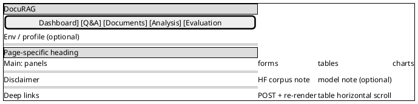
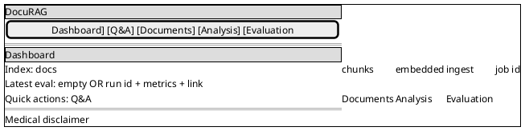
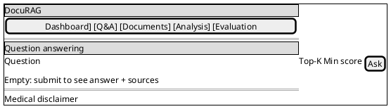
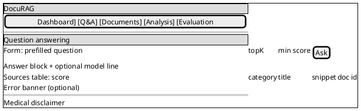
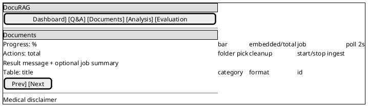
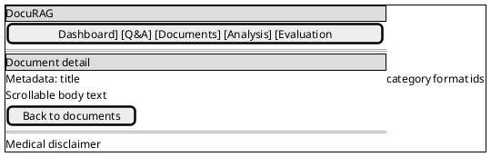
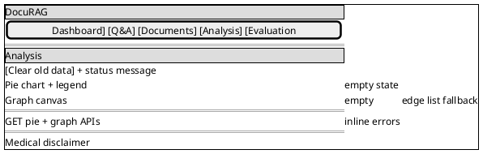
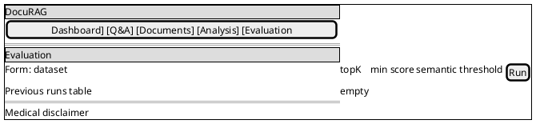
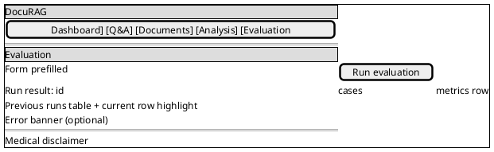
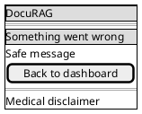

# DocuRAG — Text Wireframes (+ PlantUML Salt)

Low-fidelity wireframes for the Thymeleaf demo UI. Each screen uses the project convention from the [wireframes skill](https://github.com/berdachuk/ai-architect-6-rag/blob/main/.claude/skills/wireframes/SKILL.md) (repo: `.claude/skills/wireframes/SKILL.md`): **structured text** (regions, controls, states) plus a short **PlantUML Salt** sketch (`@startsalt` … `@endsalt`) so layout regions stay aligned between prose and diagram.

Product docs rule: [AGENTS.md](AGENTS.md). Aligned with [DocuRAG-PRD.md](DocuRAG-PRD.md), [DocuRAG-FORMS-AND-FLOWS.md](DocuRAG-FORMS-AND-FLOWS.md), and [DocuRAG-USE-CASES.md](DocuRAG-USE-CASES.md).

**Assumptions**

- Desktop-first, server-rendered Thymeleaf pages.
- Lightweight JavaScript only for progress polling, pie chart rendering, and entity graph rendering.
- No SPA shell and no user accounts in v1.
- Every interactive page includes the medical disclaimer.
- Product copy stays factual and demo-oriented.

---

## 1. Global Page Shell

**Screen: Shared shell (all UI pages)**

- Header / navigation
    - [Brand link] DocuRAG
    - [Nav] Dashboard | Q&A | Documents | Analysis | Evaluation
    - Optional status text: active profile or environment label

- Main content
    - Page-specific heading
    - Page-specific panels, forms, tables, or visualizations

- Footer / meta (safety / provenance / transparency)
    - Disclaimer: educational demo only; not medical advice
    - Dataset note: primary Hugging Face medical corpus
    - Optional model note: chat model and embedding model when configured

- Global behavior
    - Current page remains reachable by direct URL refresh
    - Forms submit with HTTP POST and re-render the server page
    - Tables remain readable on narrow screens by horizontal scrolling

---

## 2. Home / Dashboard

**Screen: Dashboard (`GET /`)**

- Header / navigation
    - [Brand link] DocuRAG
    - [Nav] Dashboard | Q&A | Documents | Analysis | Evaluation

- Main content
    - Heading: Dashboard

    - Section: Index
        - Stat: Documents: [count]
        - Stat: Chunks: [count]
        - Stat: Embedded chunks: [count]
        - Text: Last ingest status: [status]
        - Text: Last job id: [job id]

    - Section: Latest evaluation
        - Empty state:
            - Text: No evaluation runs yet
            - [Link] Evaluation
        - Populated state:
            - Text: Run id: [24-hex id]
            - Metric: Normalized accuracy: [value]
            - Metric: Mean semantic similarity: [value]
            - [Link] Open evaluation

    - Section: Quick actions
        - [Link] Ask a question
        - [Link] Browse documents
        - [Link] View analysis
        - [Link] Run evaluation

- Footer / meta
    - Medical disclaimer

---

## 3. Question Answering

**Screen: Q&A form (`GET /qa`)**

- Header / navigation
    - [Brand link] DocuRAG
    - [Nav] Dashboard | Q&A | Documents | Analysis | Evaluation

- Main content
    - Heading: Question answering

    - Form: Ask a grounded question
        - Field: Question
            - Control: multiline text area
            - Placeholder: Enter an English medical question
        - Field: Top-K
            - Control: number input
            - Default: 5
        - Field: Min score
            - Control: decimal input
            - Default: 0.5
        - [Button] Ask

    - Empty state
        - Text: Submit a question to see an answer and retrieved source chunks

- Footer / meta
    - Medical disclaimer

**Screen: Q&A result (`POST /qa`)**

- Header / navigation
    - [Brand link] DocuRAG
    - [Nav] Dashboard | Q&A | Documents | Analysis | Evaluation

- Main content
    - Heading: Question answering

    - Form: Ask a grounded question
        - Field: Question
            - Value: [submitted question]
        - Field: Top-K
            - Value: [submitted topK]
        - Field: Min score
            - Value: [submitted minScore]
        - [Button] Ask

    - Section: Answer
        - Text block: [assistant answer]
        - Optional text: model: [chat model]

    - Section: Retrieved sources
        - Table: [Score] | [Category] | [Title] | [Snippet] | [Document id]
        - Row: [score] | [category] | [title] | [snippet] | [24-hex id]

    - Error state
        - Banner: [validation, retrieval, or LLM error]
        - Form remains editable

- Footer / meta
    - Medical disclaimer

---

## 4. Documents / Ingestion

**Screen: Documents (`GET /documents`)**

- Header / navigation
    - [Brand link] DocuRAG
    - [Nav] Dashboard | Q&A | Documents | Analysis | Evaluation

- Main content
    - Heading: Documents

    - Section: Realtime indexing progress
        - Text: [percent] complete
        - Progress bar: [embedded chunks / total chunks]
        - Text: Embedded chunks: [count] / [count]
        - Text: Last ingest status: [status]
        - Text: Job: [job id]
        - Text: Auto-refresh every 2 seconds
        - Message: [current progress message]

    - Section: Ingestion actions
        - Text: Total: [document count]
        - Control: Selected data folder
            - [Button] Choose data folder
            - Text: [selected path]
            - Hidden file input for browser folder upload
        - [Button] Full cleanup (remove all docs + chunks)
        - [Button] Start ingest (toggles to Stop ingest during progress)

    - Section: Action result
        - Message: [index action status]
        - Optional ingest summary:
            - Text: Job [job id]: [status]
            - Text: loaded [count], skipped [count]
            - Optional text: [error message]

    - Section: Document table
        - Table: [Title] | [Category] | [Format] | [Id]
        - Row: [title] | [category] | [hf_export/pdf] | [24-hex id]

    - Pagination
        - [Link] Previous
        - [Link] Next

- Footer / meta
    - Medical disclaimer

**Screen: Document detail (optional UI route)**

- Header / navigation
    - [Brand link] DocuRAG
    - [Nav] Dashboard | Q&A | Documents | Analysis | Evaluation

- Main content
    - Heading: Document detail
    - Metadata
        - Text: Title: [title]
        - Text: Category: [category]
        - Text: Format: [source format]
        - Text: External id: [external id]
        - Text: Internal id: [24-hex id]
    - Content
        - Scrollable text: [source document text]
    - [Link] Back to documents

- Footer / meta
    - Medical disclaimer

---

## 5. Analysis / Visualization

**Screen: Analysis (`GET /analysis`)**

- Header / navigation
    - [Brand link] DocuRAG
    - [Nav] Dashboard | Q&A | Documents | Analysis | Evaluation

- Main content
    - Heading: Analysis

    - Section: Actions
        - [Button] Clear old data
        - Message: [analysis action status]

    - Section: Category distribution
        - Chart region: Pie chart
        - Legend list:
            - Item: [category] — [count] — [percent]
        - Empty state:
            - Text: No category data available yet

    - Section: Entity graph
        - Graph region: canvas for nodes and edges
        - Empty state:
            - Text: No entity graph data available yet
        - Fallback list:
            - Item: [source node] --[relation]--> [target node]

    - Global behavior (data loading)
        - Browser loads `GET /api/visualizations/categories/pie`
        - Browser loads `GET /api/visualizations/entities/graph`
        - If either request fails, show an inline message in the relevant section

- Footer / meta
    - Medical disclaimer

---

## 6. Evaluation

**Screen: Evaluation form (`GET /evaluation`)**

- Header / navigation
    - [Brand link] DocuRAG
    - [Nav] Dashboard | Q&A | Documents | Analysis | Evaluation

- Main content
    - Heading: Evaluation

    - Form: Run evaluation
        - Field: Dataset name
            - Control: text input
            - Default: medical-rag-eval-v1
        - Field: Top-K
            - Control: number input
            - Default: 5
        - Field: Min score
            - Control: decimal input
            - Default: 0.5
        - Field: Semantic pass threshold
            - Control: decimal input
            - Default: 0.8
        - [Button] Run evaluation

    - Section: Previous runs
        - Table: [Run id] | [Dataset] | [Created] | [Normalized accuracy] | [Mean similarity] | [Status]
        - Empty state:
            - Text: No evaluation runs yet

- Footer / meta
    - Medical disclaimer

**Screen: Evaluation result (`POST /evaluation/run`)**

- Header / navigation
    - [Brand link] DocuRAG
    - [Nav] Dashboard | Q&A | Documents | Analysis | Evaluation

- Main content
    - Heading: Evaluation

    - Form: Run evaluation
        - Same fields as Evaluation form
        - Values reflect submitted parameters
        - [Button] Run evaluation

    - Section: Run result
        - Text: Run id: [24-hex id]
        - Metric: Cases: [count]
        - Metric: Normalized accuracy: [value]
        - Metric: Mean semantic similarity: [value]
        - Metric: Semantic accuracy at threshold: [value]

    - Section: Previous runs
        - Table: [Run id] | [Dataset] | [Created] | [Normalized accuracy] | [Mean similarity] | [Status]
        - Highlight: [current run id]

    - Error state
        - Banner: [dataset missing, validation, or evaluation failure]

- Footer / meta
    - Medical disclaimer

---

## 7. Error Page

**Screen: Error**

- Header
    - [Brand link] DocuRAG

- Main content
    - Heading: Something went wrong
    - Message: [safe error message]
    - [Link] Back to dashboard

- Footer / meta
    - Medical disclaimer

---

## 8. Responsive Note

Cross-cutting layout rules (no separate page shell). Salt wireframes above assume **desktop-first** bands; on narrow viewports:

- Main content stacks vertically on narrow viewports.
- Form controls take full row width on mobile.
- Tables scroll horizontally rather than truncating values.
- Chart and graph regions keep a stable minimum height so page layout does not jump while data loads.

---

## 9. Traceability

| Wireframe | Route | Forms doc | Use cases | PRD |
|-----------|-------|-----------|-----------|-----|
| Global Page Shell | all UI pages | Global UI rules | all UI UCs | NFR-5 |
| Home / Dashboard | `/` | F-01 optional | UC-02, UC-08, UC-19, UC-20 | UI requirements |
| Question Answering | `/qa` | F-02 | UC-10 | FR-4 |
| Documents / Ingestion | `/documents` | F-04 + F-01-style actions | UC-01, UC-01b, UC-03, UC-08 | FR-1, FR-2, FR-3 |
| Analysis / Visualization | `/analysis` | F-03 | UC-14 | FR-5, FR-6 |
| Evaluation | `/evaluation` | F-05 | UC-15, UC-19 | FR-7 |
| Error Page | error route if added | n/a | support scenario | NFR-5 |

**Document version:** 2.1 — PlantUML Salt companions added per wireframes skill; “Footer” sections renamed to **Footer / meta** for consistency with skill vocabulary. Update when templates, OpenAPI, or the page inventory changes.
